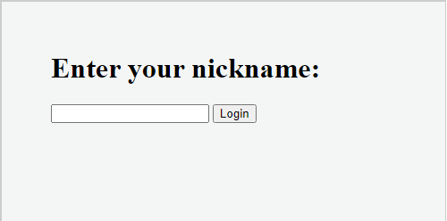
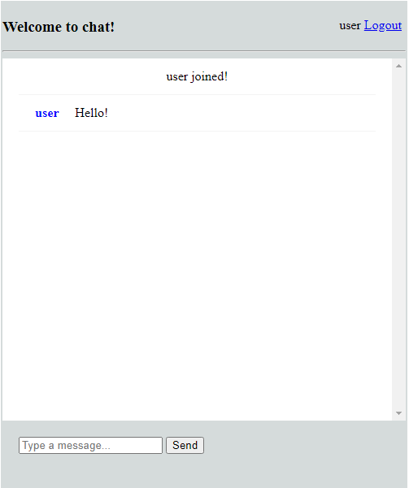

# chatroom
The simple chatting application






#### Basic operations
* Logon/logoff users
* Chatting with others  
 
#### Used technologies
* Spring Boot
* WebSocket
* RabbitMQ 
* Maven 

#### Run and build 
using command:

```
docker-compose -f /enviroment/docker-compose.yaml up --build 
```

